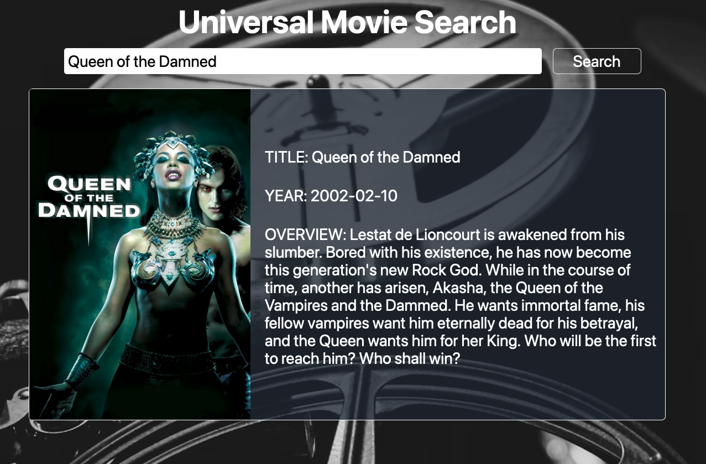

<h1 align='center'> Universal Movie Searcher</h1>

---

## Objective

The purpose of our movie search application is to allow the user to search any movie and provided with details. Such as; the official title, the release date and a synopsis of the movie. The search also retrieves a poster of the movie.

---

## Process: Technologies

For this application, we used a variety of different tools to achieve the desired result. Below is a list of the different technologies used for this application:

- TailwindCSS to style our the application
- Javascript to add functionality to the application
- Server side (third party) APIs, The Movie Database Api (TMDB), to fetch the desired information for our application.
- GitHub to keep our code up to date and organized during the development process.

---

## DEMO - Image of our Moive Search App

## LINKS

> - GitHub Repo: https://github.com/b3nl99/UMS-universal-movie-searcher
